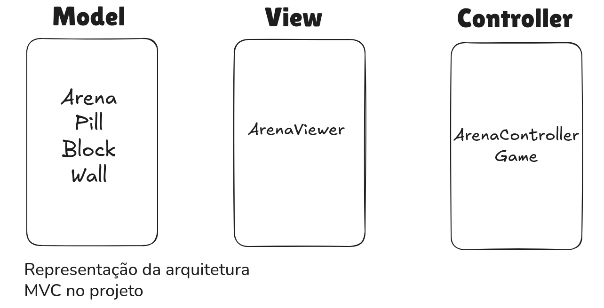
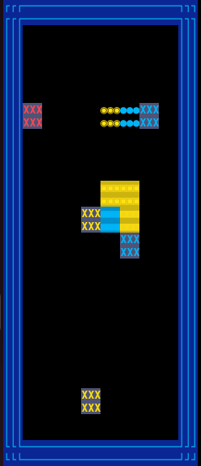
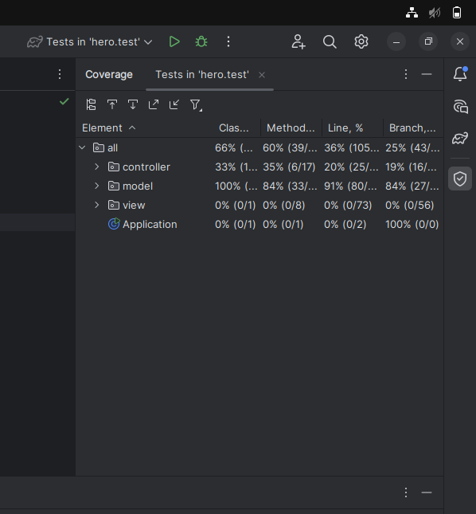
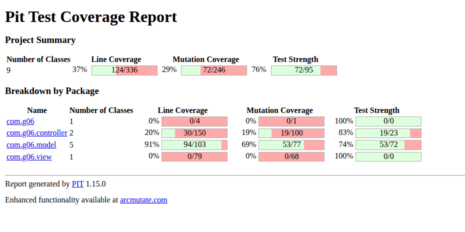

# LDTS_T01_G06 - Dr. Lanterna

## Game Description

Dr. Lanterna is a puzzle arcade game based on the classic Dr. Mario, where the objective is to eradicate deadly viruses inside a bottle using colored vitamin capsules. The player must strategically align falling pills to match the colors of the viruses, eliminating them from the board.
The game challenges the player's quick thinking and planning, as the speed of the falling pills increases with each level, requiring precise movements and rotations to prevent the bottle from filling up.
This project was developed by Henrique Albasini Dias (up202407419@fe.up.pt) and Tomás Luís de Carvalho Rocha(up202405435@fe.up.pt) for LDTS 2025-26.

## Implemented Features

- **Arena Generation** - The game starts with a board surrounded by walls and populated with viruses in random positions.
- **Pill Mechanics** - Pills are generated at the top with random colors and fall due to gravity.
- **Movement & Rotation** - The player can move the active pill left, right, rotate it (90 degrees), and force a faster drop (Soft Drop).
- **Collision Detection** - The system verifies collisions between the active pill, walls, viruses, and already settled blocks.
- **Line Clearing** - When 4 or more blocks of the same color (viruses or pill parts) are aligned vertically or horizontally, they are removed from the board.
- **Gravity Physics** - Implementation of gravity for the active pill and for floating blocks after line clears.
- **MVC Architecture** - Clear separation between game logic, data, and visualization.

## Planned Features

- **Game States** - Implementation of Menus (Start, GameOver, Instructions).

- **Scoring System** - Score counting based on the number of viruses eliminated.

- **Next Pill Preview** - Visualization of the next pill to enter the game.

- **Level Progression** - Difficulty increase (more viruses) as the player progresses.

## Design

### General Structure
Model-View-Controller (MVC)

### MVC
#### Problem in Context:
The initial concern was avoiding a "God Class" where game logic, data storage, and screen rendering were mixed. The game handles significant grid manipulation logic (checking lines, gravity, rotation) which should not be intertwined with the graphics library code (Lanterna).

#### The Pattern:
We applied the Architectural Pattern MVC (Model-View-Controller). This pattern separates the application into three main components:
- Model: Stores the data.
- View: Displays the data.
- Controller: Updates the data based on input or rules.  

#### Implementation:
- Model (Arena, Pill, Block, Wall): Classes that only store the game state. The Arena holds the block matrix and the current pill but contains no movement logic.
- View (ArenaViewer): Responsible for reading the Arena state and drawing the corresponding characters on the terminal using the Lanterna library.
- Controller (ArenaController): Contains all game logic. It is responsible for processing keyboard input, checking collisions (canMove), applying gravity (fallPill), and checking for line clears (checkAndClearLines).

  

  <b><i>Model, Controller and Viewer pattern design</i></b>

#### Consequences:
- High Cohesion: Each class has a single responsibility.
- Testability: The ArenaController can be unit tested without depending on the graphical interface.
- Ease of Modification: We can change how viruses are drawn (View) without the risk of breaking collision logic (Controller).

### Game Loop & Input Handling
#### Problem in Context:
The game needs to react to user inputs in real-time but also needs to update the game state automatically (pill gravity) regardless of input. Using blocking methods like readInput() would prevent the pill from falling on its own.

#### The Pattern:
We used the Game Loop pattern. The game runs in an infinite loop that periodically checks for input and updates the game physics based on elapsed time.

#### Implementation:
In the Game class, the run() method maintains a while(true) loop.
- Input: Uses screen.pollInput() (non-blocking) to detect keystrokes. If input exists, it delegates immediately to ArenaController.processKey().
- Update (Time-based): Checks if FALL_DELAY_MS (500ms) has passed. If so, invokes com.g06.controller.fallPill() to enforce gravity.
- Render: Invokes viewer.draw(arena) to update the screen.

#### Consequences:
Fluidity: The game does not block waiting for the player.
Time Separation: Gravity speed is independent of computer processing speed or input frequency.

### Arena Generation
#### **Problem in Context:
Creating the Arena is complex as it involves not only initializing the grid but also creating surrounding walls and scattering viruses randomly and validly.

#### Implementation:
The Arena class uses methods (createWalls, spawnViruses) in its constructor to assemble the initial level. spawnViruses ensures viruses do not overlap and have valid colors.

  

  <b><i> Screenshot of the Arena</i></b>

#### Consequences:
- Encapsulation of level creation logic.
- Ensures that when creating a new Arena, it always comes in a valid and playable state.

## Known-code smells
- Long Method: The checkAndClearLines method in ArenaController is somewhat complex and could be further subdivided.
- Data Class: The Position class is purely a data class, but this is intentional as it serves as a Value Object throughout the project.

## Testing

### Screenshot of coverage report

  

  <b><i> Code coverage screenshot</i></b>

### Screenshot of mutation testing report

  

  <b><i> Code mutation testing screenshot</i></b>

## Self-evaluation

The work was divided equally. 

- Henrique Albasini: 50%
- Tomás Rocha: 50%
